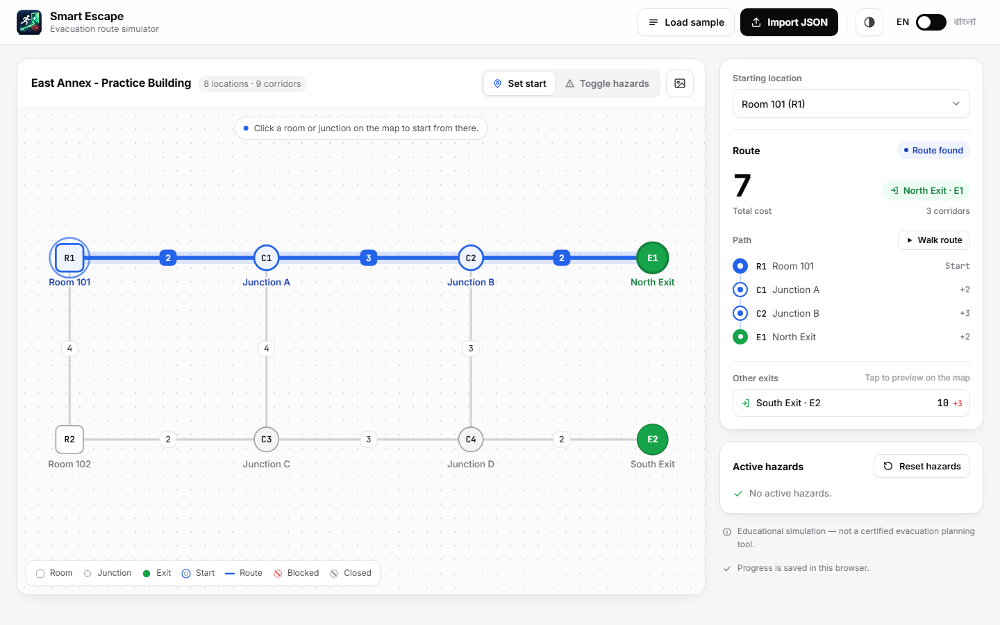
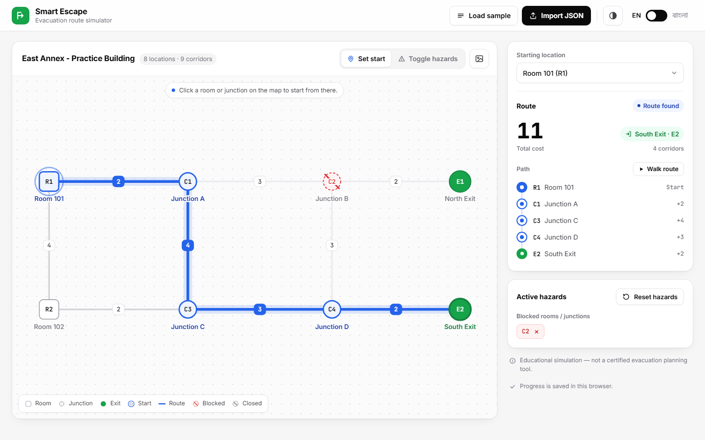
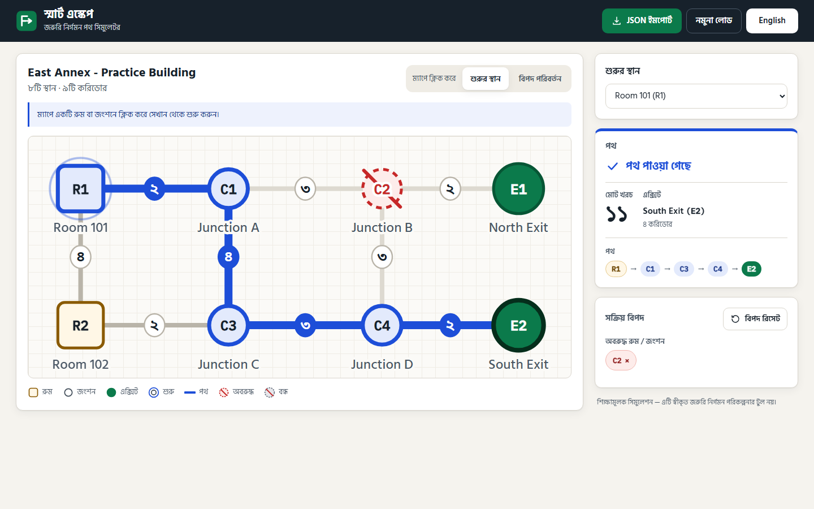

# Smart Escape — Interactive Evacuation Route Simulator

AI DevFest 2026 mock test (solo vibe-coding).

- **Name:** Mostafizur Rahman Sani
- **Registration number:** aif_a608a4e78c8b4254a9a8
- **Live link:** https://devfest-aifa608a4e78c8b4254a9a8.vercel.app/

> Smart Escape is an educational simulation, not a certified real-world evacuation planning tool.

## How to run

No build step and no dependencies — plain HTML, CSS and JavaScript.

- Open `index.html` directly in Chrome, **or**
- serve the folder statically, e.g. `npx serve .` / `python -m http.server`, and open the printed URL.

Deployed as a static site on Vercel from the `main` branch (no build step).

## Main features (all mandatory tasks)

- **Import and map** — import any `building.json` (or load the organizer sample). The file is fully validated (required fields, 2–60 nodes, 1–150 edges, unique IDs, valid endpoints, positive integer costs, no self-loops or repeated pairs, initial-state IDs exist and match their category). Invalid files are rejected with a list of clear errors. Nodes are drawn at their supplied coordinates with distinct shapes per type (room = square, junction = circle, exit = green circle), readable labels and cost badges on every corridor.
- **Select and calculate** — pick a start by clicking a room/junction on the map or with the dropdown. The lowest-cost route is highlighted, with the node sequence, exit and total cost.
- **Change conditions** — switch to *Toggle hazards* mode and click a room/junction (block/unblock), a corridor (block/unblock) or an exit (close/reopen). Blocked = red dashed outline + slash; closed exit = grey dashed + slash; blocked corridor = red dashed line + ✕ on the cost badge. Active hazards are also listed as removable tags.
- **Update and reset** — the route is recalculated on every change; *Reset hazards* restores the file's original `initial_state`.
- **Failure cases** — shows **No route available** and **Starting location blocked**.
- **Two languages** — full Bangla / English switch (saved in localStorage); all labels, buttons, statuses, errors and instructions are translated, numbers use Bangla digits in Bangla mode.
- **Animation** — route segments draw from start to exit, path chips appear in sequence, toggled elements pop briefly, start location pulses. Respects `prefers-reduced-motion`.

### Routing rules

Dijkstra on positive integer edge costs (never coordinates or hop count). Blocked nodes (and their corridors), blocked corridors and closed exits are removed entirely. The cheapest reachable open exit wins; ties go to the lexicographically smallest exit ID. Among equal-cost paths to that exit, the route walks forward choosing the smallest next node ID that stays on a shortest path, which yields the lexicographically smallest node sequence. Code: `js/graph.js`.

Sample checks (all pass): R1 → `R1-C1-C2-E1` cost 7 · block C2 → `R1-C1-C3-C4-E2` cost 11 · close E1+E2 → No route available · R2 → `R2-C3-C4-E2` cost 7 · block R1 → Starting location blocked.

## Bonus features

- **Alternative routes** — the cheapest route to every other reachable exit is listed with its cost difference; click one to preview it as a dashed line on the map.
- **Route walkthrough** — "Walk route" moves a marker along the route corridor by corridor while the path list highlights each step (step-by-step jumps when reduced motion is on).
- **PNG export** — download the current map, route and hazards as a PNG.
- **Saving progress** — the loaded building, start, hazards and mode are saved in localStorage and restored (and re-validated) on reload.
- **High-contrast mode** — toggle in the header; stronger lines, borders and text. Saved per browser.
- Keyboard accessible map (Tab to nodes/corridors, Enter/Space to act), visible focus rings, ARIA labels.
- Removable hazard tags in the side panel; responsive layout for tablet and mobile.

## Screenshots

**Baseline route from R1** — R1 → C1 → C2 → E1, cost 7



**Rerouting after C2 is blocked** — R1 → C1 → C3 → C4 → E2, cost 11



**Bangla mode**



## Known issues

- Very dense graphs (close coordinates) can make labels overlap, since nodes are drawn exactly at the supplied coordinates.

## AI tools used

- Claude Code (Claude Opus) for planning, code generation and testing.

## Most useful prompt

> "now start building the project, im late sot, 50 minutes remaining"  — with the problem statement and rulebook loaded as context, this produced the validated routing engine and full UI in one pass.

## Project structure

```
index.html          page shell
css/styles.css      design tokens + styles
js/i18n.js          Bangla/English dictionary and t() helper
js/graph.js         validation + routing (pure functions)
js/app.js           state, SVG map rendering, events
js/sample.js        organizer sample embedded for "Load sample"
sample/building.json organizer sample file
```

## License

MIT — see `LICENSE`.
